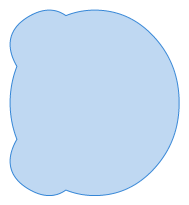
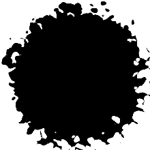

# Doggie - A Cross-platform Library for Swift

[](https://github.com/SusanDoggie/Doggie/actions)
[](https://codecov.io/gh/SusanDoggie/Doggie)

[](https://github.com/SusanDoggie/Doggie/releases)
[](https://swift.org)
[](LICENSE)

Doggie is a foundational library for Apple's swift. It includes mathematics, accelerate, signal processing and graphic functions.

## Apps Using This Library

[](https://apps.apple.com/hk/app/doggie-graffiti/id1465865578)

## Features

- accelerate, signal processing, fourier and convolution
- complex number, point, vector and 2D/3D transformation
- bezier curve
- [polynomial](docs/Polynomial.md)
- [color](docs/Color.md) and [color space](docs/ColorSpace.md)
- [shape](docs/Shape.md) and [boolean operation](docs/ShapeRegion.md)
```swift
let shape = try Shape(code: "M100 0c0-100-236.60 36.60-150 86.60S36.60-136.60-50-86.60 100 100 100 0z")

let region = ShapeRegion(shape, winding: .nonZero)
let ellipse = ShapeRegion(ellipseIn: shape.boundary)
```
operation | preview
--- | ---
``region.union(ellipse)`` | 
``region.intersection(ellipse)`` | 
``ellipse.subtracting(region)`` | 
``region.subtracting(ellipse)`` | 
``region.symmetricDifference(ellipse)`` | 
- [font](docs/Font.md)
```swift
let collection = try FontCollection(data: fontFileData)

if let font = collection.first?.with(size: 64) {

    let string = "Doggie\u{0301}".precomposedStringWithCanonicalMapping

    let glyphs = font.glyphs(with: string.unicodeScalars)
    let advances = glyphs.map { font.advance(forGlyph: $0) }.scan(0, +)

    var shape = Shape()

    for (advance, glyph) in zip(advances, glyphs) {
        var outline = font.shape(forGlyph: glyph)
        outline.center.x += advance
        shape.append(contentsOf: outline.identity)
    }

    print(shape.encode())
}
```
- [image](docs/Image.md) and [graphics](docs/ImageContext.md) with 2D/3D drawing
```swift

let context = ImageContext<ARGB32ColorPixel>(width: 100, height: 100, colorSpace: ColorSpace.sRGB)

let ellipse1 = Shape(ellipseIn: Rect(x: 10, y: 35, width: 55, height: 55))
let ellipse2 = Shape(ellipseIn: Rect(x: 35, y: 10, width: 55, height: 55))

context.draw(shape: ellipse1, winding: .nonZero, color: RGBColorModel(red: 247/255, green: 217/255, blue: 12/255))
context.stroke(shape: ellipse1, width: 1, cap: .round, join: .round, color: RGBColorModel())
context.draw(shape: ellipse2, winding: .nonZero, color: RGBColorModel(red: 234/255, green: 24/255, blue: 71/255))
context.stroke(shape: ellipse2, width: 1, cap: .round, join: .round, color: RGBColorModel())
        
let image: Image<ARGB32ColorPixel> = context.image
```

- others
```svg
<svg width="200" height="200" viewBox="0 0 220 220"
     xmlns="http://www.w3.org/2000/svg">
  <filter id="displacementFilter">
     <feTurbulence type="turbulence" baseFrequency="0.05"
        numOctaves="2" result="turbulence"/>
     <feDisplacementMap in2="turbulence" in="SourceGraphic"
        scale="50" xChannelSelector="R" yChannelSelector="G"/>
  </filter>

  <circle cx="100" cy="100" r="100"
     style="filter: url(#displacementFilter)"/>
</svg>
```
```swift
let context = ImageContext<Gray16ColorPixel>(width: 220, height: 220, colorSpace: .default)

context.draw(ellipseIn: Rect(x: 0, y: 0, width: 200, height: 200), color: .black)

var image = context.image

let turbulence: Image<RGBA32ColorPixel> = SVGTurbulence(220, 220, .turbulence, nil, .identity, 0, 0.05, 2)

image = DisplacementMap(image, turbulence, 0, 1, 50)
```


## Documents

Documents can find in [here](docs/index.md).

## Status

### ColorSpace

#### Format
- [x] ICC
- [x] CIEXYZ
- [x] CIELab
- [x] CIELuv
- [x] Calibrated Gray
- [x] Calibrated RGB

#### Rendering Intent
- [x] perceptual
- [ ] saturation
- [x] absolute colorimetric
- [x] relative colorimetric

### ImageRep
- [x] bmp
- [ ] gif
- [ ] jpeg
- [ ] jpeg2000
- [x] png
- [x] tiff

### Font

#### Format
- [x] TrueType
- [x] TrueType/TTC
- [x] OpenType
- [x] OpenType/CFF
- [ ] OpenType/CFF2
- [x] WOFF
- [x] WOFF/CFF
- [ ] WOFF/CFF2
- [ ] WOFF2

#### SFNT Tables
- [x] HEAD
- [x] POST
- [x] OS/2
- [x] MAXP
- [x] CMAP
- [x] NAME
- [x] HHEA
- [x] HMTX
- [x] VHEA
- [x] VMTX
- [x] LOCA
- [x] GLYF
- [x] SBIX
- [x] FEAT
- [ ] KERX
- [ ] MORX
  - [x] Rearrangement
  - [x] Contextual
  - [x] Ligature
  - [x] Noncontextual
  - [ ] Insertion
- [ ] GSUB
- [ ] GPOS
- [ ] GDEF
- [x] CFF
- [ ] CFF2

#### CMAP

##### Platform

The table below lists the available platform/specific values in the order.

platform | specific | Description
--- | --- | ---
0 | max( <= 4 ) | Unicode
3 | 10 | Windows, Unicode UCS-4
3 | 1 | Windows, Unicode BMP (UCS-2)

##### Format
- [x] Format 0
- [x] Format 4
- [x] Format 12
- [x] Format 14 (Unicode Variation Selectors)

## How To Contribute

It's welcome everyone to create a pull request.

## License

Doggie is licensed under the [MIT license](LICENSE).
